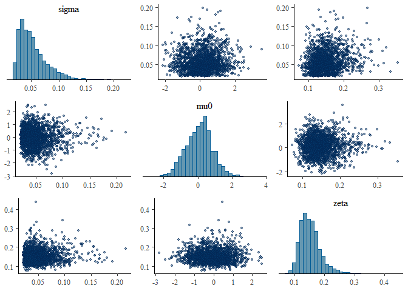

<!-- README.md is generated from README.Rmd. Please edit that file -->

# bennu 

**B**ayesian **E**stimation of **N**aloxone **N**umbers
**U**nderreporting (**BENNU**)

*The package name comes from the Welsh word for “to finish” (pronounced
benn-y)*

<!-- badges: start -->
[](https://github.com/sempwn/bennu/actions/workflows/R-CMD-check.yaml)
[](https://lifecycle.r-lib.org/articles/stages.html#experimental)
[](https://app.codecov.io/gh/sempwn/bennu?branch=main)

<!-- badges: end -->

An R package 📦 for generating estimates of total naloxone kit numbers
distributed and used from naloxone kit orders data.

## Installation

You can install the released version of bennu from
[CRAN](https://CRAN.R-project.org) with:

``` r
install.packages("bennu")
```

And the development version from [GitHub](https://github.com/) with:

``` r
# install.packages("devtools")
devtools::install_github("sempwn/bennu")
```

## Example

This example runs output for test data generated by the package:

``` r
library(bennu)
library(rstan)
#> Loading required package: StanHeaders
#> Loading required package: ggplot2
#> rstan (Version 2.21.2, GitRev: 2e1f913d3ca3)
#> For execution on a local, multicore CPU with excess RAM we recommend calling
#> options(mc.cores = parallel::detectCores()).
#> To avoid recompilation of unchanged Stan programs, we recommend calling
#> rstan_options(auto_write = TRUE)
#> Do not specify '-march=native' in 'LOCAL_CPPFLAGS' or a Makevars file
library(bayesplot)
#> This is bayesplot version 1.8.1
#> - Online documentation and vignettes at mc-stan.org/bayesplot
#> - bayesplot theme set to bayesplot::theme_default()
#>    * Does _not_ affect other ggplot2 plots
#>    * See ?bayesplot_theme_set for details on theme setting

rstan_options(auto_write = TRUE)
options(mc.cores = parallel::detectCores(logical = FALSE))

## basic example code
d <- generate_model_data()
# note iter should be at least 2000 to generate a reasonable posterior sample
fit <- est_naloxone(d,iter=500)
mcmc_pairs(fit, pars = c("sigma","mu0","zeta"),
           off_diag_args = list(size = 1, alpha = 0.5))
```



## Getting help

If you encounter a clear bug, please file an issue with a minimal
reproducible example on
[GitHub](https://github.com/sempwn/bennu/issues).
