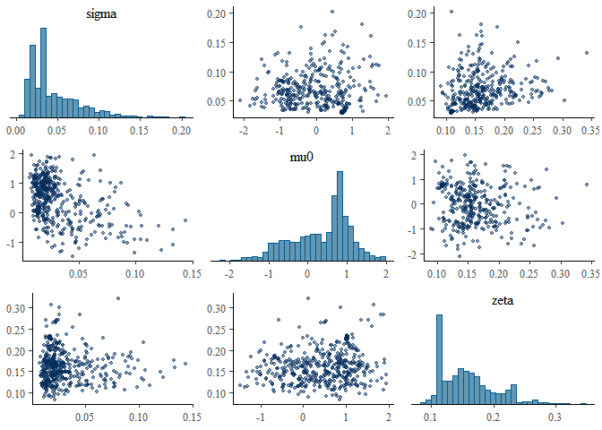

<!-- README.md is generated from README.Rmd. Please edit that file -->

# bennu 

**B**ayesian **E**stimation of **N**aloxone **N**umbers
**U**nderreporting (**BENNU**)

*The package name comes from the Welsh word for “to finish” (pronounced
benn-y)*

<!-- badges: start -->
[](https://github.com/sempwn/bennu/actions/workflows/R-CMD-check.yaml)
[](https://lifecycle.r-lib.org/articles/stages.html#experimental)
[](https://app.codecov.io/gh/sempwn/bennu?branch=main)

<!-- badges: end -->

An R package 📦 for generating estimates of total naloxone kit numbers
distributed and used from naloxone kit orders data.

## Installation

You can install the released version of bennu from
[CRAN](https://CRAN.R-project.org) with:

``` r
install.packages("bennu")
```

And the development version from [GitHub](https://github.com/) with:

``` r
# install.packages("devtools")
devtools::install_github("sempwn/bennu")
```

## Example

This is a basic example which shows you how to solve a common problem:

``` r
library(bennu)
library(rstan)
#> Loading required package: StanHeaders
#> Loading required package: ggplot2
#> rstan (Version 2.21.2, GitRev: 2e1f913d3ca3)
#> For execution on a local, multicore CPU with excess RAM we recommend calling
#> options(mc.cores = parallel::detectCores()).
#> To avoid recompilation of unchanged Stan programs, we recommend calling
#> rstan_options(auto_write = TRUE)
#> Do not specify '-march=native' in 'LOCAL_CPPFLAGS' or a Makevars file
library(bayesplot)
#> This is bayesplot version 1.8.1
#> - Online documentation and vignettes at mc-stan.org/bayesplot
#> - bayesplot theme set to bayesplot::theme_default()
#>    * Does _not_ affect other ggplot2 plots
#>    * See ?bayesplot_theme_set for details on theme setting

rstan_options(auto_write = TRUE)
options(mc.cores = parallel::detectCores(logical = FALSE))

## basic example code
d <- generate_model_data()
# note iter should be at least 2000 to generate a reasonable posterior sample
fit <- est_naloxone(d,iter=500)
mcmc_pairs(fit, pars = c("sigma","mu0","zeta"),
           off_diag_args = list(size = 1, alpha = 0.5))
```



What is special about using `README.Rmd` instead of just `README.md`?
You can include R chunks like so:

``` r
summary(cars)
#>      speed           dist       
#>  Min.   : 4.0   Min.   :  2.00  
#>  1st Qu.:12.0   1st Qu.: 26.00  
#>  Median :15.0   Median : 36.00  
#>  Mean   :15.4   Mean   : 42.98  
#>  3rd Qu.:19.0   3rd Qu.: 56.00  
#>  Max.   :25.0   Max.   :120.00
```

You’ll still need to render `README.Rmd` regularly, to keep `README.md`
up-to-date. `devtools::build_readme()` is handy for this. You could also
use GitHub Actions to re-render `README.Rmd` every time you push. An
example workflow can be found here:
<https://github.com/r-lib/actions/tree/master/examples>.

You can also embed plots, for example:


In that case, don’t forget to commit and push the resulting figure
files, so they display on GitHub and CRAN.
